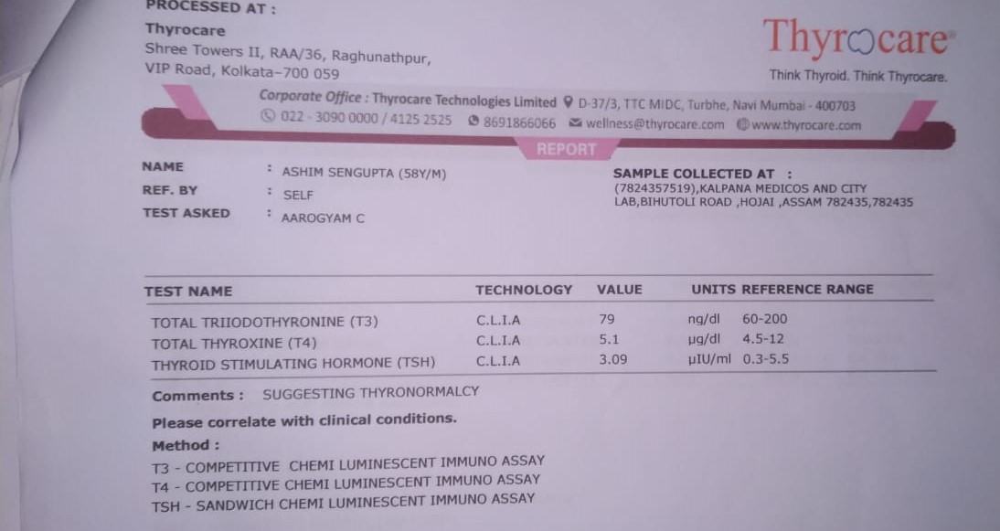

# Custom-OCR-YOLO
 
 
 
This is a Custom OCR built by combining YOLO and Tesseract, to read the specific contents of a Lab Report and convert it into an editable file.
Here I have used YOLO_V3 trained on personal dataset. Then the coordinates of the detected objects are passed for cropping the deteted objects and storing them in another list. This list is passed through the Tesseract to get the desired output.

## Model
- Download the weights file from this link : https://drive.google.com/file/d/1o6_3dcsMd9sUFblvyWyraeuMEifzE1YA/view?usp=sharing
- Make a folder named model and put the weights file inside it.

## Data
- Link for the dataset https://drive.google.com/drive/folders/1uAc8xE6AS8YCb65iNMFyEfB5dzAWsgFN?usp=sharing

## Dependencies
- Install Tesseract OCR Engine in the system ` https://github.com/UB-Mannheim/tesseract/wiki `
- Install Pytesseract library ` pip install pytessercat `
- Install OpenCV ` pip opencv `

## Workflow

   

## Getting Started

`python Custom_OCR.py --image <yourimage.jpg>`

#### Step by Step Workflow

This section will highlight the steps I took in order to implement the Custom-OCR with YOLOv3 and potential areas to be worked on further.

This will show the step-by-step workflow on the following original image.

##### Detected regions

The first step of the process is taking the bounding box coordinates from YOLOv3 and simply taking the region within the bounds of the box. As this image is super small, we use cv2.resize() to blow the image up 3x its original size.

## Contributing
Currently it is in R&D Phase.

### Step 1

- **Option 1**
    - 🍴 Fork this repo!

- **Option 2**
    - 👯 Clone this repo to your local machine using `https://github.com/Borahb/Custom-OCR-YOLO.git`

### Step 2

- **HACK AWAY!** 

### Step 3

- 🔃 Create a new pull request 

## License

- **[MIT license](http://opensource.org/licenses/mit-license.php)**
